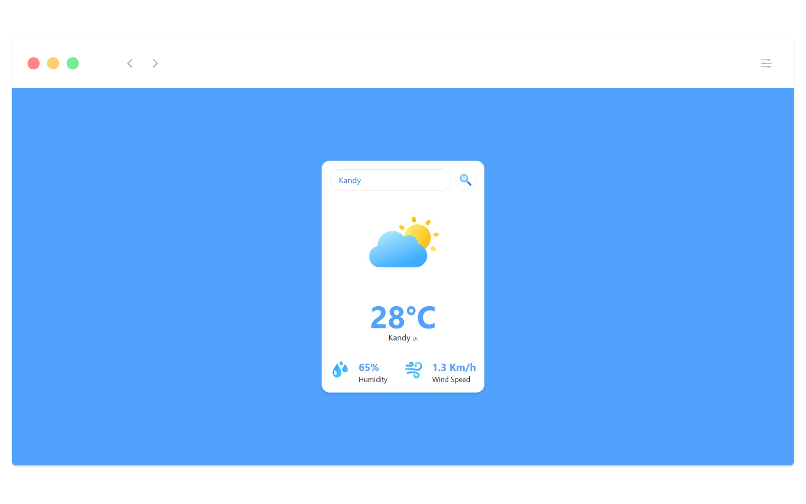

# React Weather App  

This is a simple weather application built using React. It allows users to search for the current weather of any city by fetching data from the OpenWeatherMap API. This project is part of my React learning journey, focusing on practical implementation to enhance my understanding of React concepts.  
  

## Features  
- Search for weather information by city name.  
- Displays temperature, humidity, wind speed, and weather conditions.  
- Dynamic weather icons based on the current weather.  

## Technologies Used  
- **React**: For building the user interface.  
- **OpenWeatherMap API**: For fetching real-time weather data.  - [OpenWeatherMap API](https://openweathermap.org/api) 
- **Tailwind CSS**: For styling the application.  

## How It Works  
1. The user enters a city name in the search bar.  
2. On pressing "Enter" or clicking the search icon, the app fetches weather data from the OpenWeatherMap API.  
3. The app displays the weather details, including temperature, humidity, wind speed, and an appropriate weather icon.  

## Installation and Setup  
1. Clone the repository:  
  ```bash  
  git clone https://github.com/your-username/react-weather-app.git  
  ```  
2. Navigate to the project directory:  
  ```bash  
  cd react-weather-app  
  ```  
3. Install dependencies:  
  ```bash  
  npm install  
  ```  
4. Create a `.env` file in the root directory and add your OpenWeatherMap API key:  
  ```env  
  VITE_WEATHER_API_KEY=your_api_key_here  
  ```  
5. Start the development server:  
  ```bash  
  npm run dev  
  ```  
6. Open the app in your browser at `http://localhost:5173`.  

## Learning Outcomes  
- Understanding React hooks like `useState`.  
- Handling API requests using `fetch`.  
- Managing component state and props.  
- Dynamically rendering UI elements based on data.  

## Future Improvements   
- Implement a loading spinner while fetching data.  
- Enhance the UI/UX with animations and better styling.  

This project is a stepping stone in my React learning journey, and I look forward to building more complex applications in the future!  
